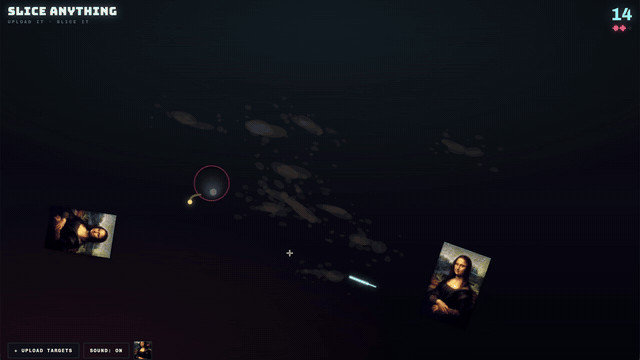

# Slice Anything

**Play it: https://nikhil-mat.github.io/sliceanything/**
Joke Repo built using Opus 5

Fruit-ninja style slicing game where you supply the targets. Drop in photos —
they get launched into the air for you to cut in half.

[](https://github.com/nikhil-mat/sliceanything/raw/main/media/chopping-monalisa.mp4)

*Uploading the Mona Lisa and cutting her to pieces —
[watch the full clip with sound](https://github.com/nikhil-mat/sliceanything/raw/main/media/chopping-monalisa.mp4) (21s).*

`public/index.html` is the entire game: one file, no dependencies, no audio
assets, and its only image is the Mona Lisa inlined as a data URI. Hosted on GitHub Pages (`.github/workflows/pages.yml` uploads `public/` on
every push to `main`), and deployable to Cloudflare Workers as a static-assets
app from the same directory.

## Playing

- **Targets** come from the file picker, drag-and-drop anywhere, or paste from
  the clipboard. With nothing uploaded it falls back to emoji fruit.
- **Slice** by dragging the blade across a target. Chained slices inside the
  combo window escalate: 1, then 2, then 3 points, with a banner at 3, 5, 8, 12.
- **Criticals** fire on roughly one slice in eight and pay double.
- **Bombs** cost a life. So does letting a target fall past you. Three and the
  round is over.
- **Frost orbs** slow time to a third for 4.5 seconds. Missing one is free.
- Sound is a WebAudio synth kit — blade whoosh, slice, splat, freeze chime,
  explosion, game-over chord. Toggle with the Sound button. `Space` restarts,
  `Esc` pauses out to the menu.

## Run locally

```
npx wrangler dev
```

## Deploy

```
npx wrangler deploy
```

Publishes to your Cloudflare account at `sliceanything.<your-subdomain>.workers.dev`.

## Tests

Six Playwright suites (60 checks) drive the real game in Chromium: uploads and
roster handling, slicing geometry and half-generation, combo and bomb rules, the
frost/critical/splatter mechanics, Mona Lisa mode, and the audio graph — verified
by counting oscillator and buffer-source starts, so a silent regression fails the
build.

```
npx wrangler dev --port 8788          # one shell
cd test && npm i playwright-core && ./run.sh
```

`test/chrome.js` finds a browser via `CHROME_PATH`, a cached Playwright build,
or system Chrome.

`node test/spectrum.js` is a measuring tool rather than a test: it renders a
voice offline through the kit at `window.SLICE.audio` and prints where its
energy sits (spectral centroid, peak, share above 3 kHz, ring length), so
sound changes can be compared instead of guessed at.
